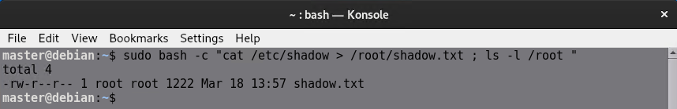
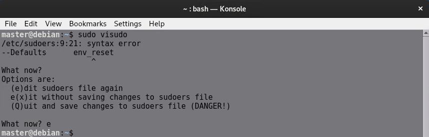

### SUDO (Super User Do) Yönetimi

- **SUDO Nedir?**
  - **SUDO** (Super User Do), düşük yetkilere sahip kullanıcıların yüksek yetki gerektiren işlemleri gerçekleştirmelerine olanak tanır. Bu, kullanıcıların "root" gibi yönetici haklarına sahip olmadan bazı kritik komutları çalıştırmalarını sağlar.


  - Bazı Linux dağıtımlarında **sudo** paketinin kurulması gerekir. 
    ```bash
    apt install sudo
    ```

- **Kullanıcıyı Sudo Grubuna Ekleme**
  - Bir kullanıcı, aşağıdaki komutla **sudo** grubunun üyesi yapılabilir:
    ```bash
    usermod -aG sudo <username>
    ```
     

  - Bu işlem sonrasında kullanıcının sudo kullanabilmesi için sistemin yeniden başlatılması (reboot) gerekebilir.

- **Sudo Kullanımı**
  - Kullanıcı, bir komutu **sudo** yetkisiyle çalıştırmak için şu şekilde kullanır:
    ```bash
    sudo <komut>
    ```

      

- **Sudo ile Shell Redirection ve Builtin Komutları Kullanma**
  - **Sudo**, Shell Redirection ve Shell Builtin komutları ile çalıştırılamaz. 

  - **Shell Redirection,** komutların çıktılarının bir dosyaya veya başka bir komuta yönlendirilmesi işlemidir. Linux'ta bu işlem genellikle >, >>, < gibi sembollerle yapılır.

  

    Aşağıdaki resimde yukarıdaki resimden farklı olarak master kullanıcısının root altında dosya oluşturabilmesinin nedeni `sudo bash` komutu ile sudo yetkileriyle yeni bir shell açmasından dolayı.

  

  - **Shell Builtin komutları,** doğrudan shell tarafından işlenen ve dışarıdan bir program başlatmaya gerek olmayan komutlardır. Bu komutlar shell ile birlikte gelir ve işletim sisteminde ek bir program yüklemeye gerek kalmaz. Örneğin: cd, echo, pwd, exit, set
  
    Sudo shell builtin komutların bazılarıyla kullanılabilir ama bunun bir mantığı yoktur, gereksizdir.

  
  
  Detaylar için:
    ```bash
    man builtins
    ```

- **Sudo Yetkileri ve Konfigürasyon**
  - Sudo yetkileri ve sınırlamaları, **/etc/sudoers** dosyasında belirlenir. Bu dosya, kullanıcıların hangi komutları, hangi şartlarla çalıştırabileceğini tanımlar.

  - **visudo** komutu ile bu dosya düzenlenmelidir. **visudo**, dosya üzerinde yapılan düzenlemeleri kontrol eder ve imla hatalarını engeller, böylece sistemin kilitlenmesini önler.

  ```
  sudo visudo 
  ```
    komutu ile direkt olarak sudoers dosyasını düzenlemek için açabilirsiniz.

    

    visudo ile yaptığınız düzenlemede hata varsa aşağıdaki gibi uyarı alırsınız.

     

- **Sudoers Dosyasındaki Temel Anlamlar**
  - Örneğin, **root ALL=(ALL:ALL) ALL**:
    - **root**: Kullanıcı adı
    - **1. ALL**: Tüm terminaller (tty’ler)
    - **2. ALL**: Tüm kullanıcılar 
    - **3. ALL**: Tüm gruplar
    - **4. ALL**: Tüm komutlar

    **%sudo ALL=(ALL:ALL) ALL** ifadesi ile sudo grubuna dahil olan kullanıcıların yapabilecekleri belirtilmiştir.

  - Başka bir kullanıcı belirlenebilir ve **ALL** ifadeleri daraltılabilir.

    

    Master kullanıcısını sudo grubundan çıkarıp sudoers dosyasını yukarıdaki şekilde düzenlediğimizde master kullanıcısı sudo ile apt komutunu kullanabilir ancak başka bir komutu kullanamaz.

     

    Aşağıdaki örnek master kullanıcısının komutu kendi için kullanamaması ama başka bir grup için kullanabilmesini gösteriyor.

     

     

     Aşağıdaki örnek istisnaların nasıl verileceğini göstermektedir.

     

     

     


- **NOPASSWD Kullanımı**
  - **NOPASSWD** ifadesi, sudo kullanımında parola istenmemesini sağlar:
    ```bash
    username ALL=(ALL) NOPASSWD: ALL
    ```
    

- **Alias Kullanımı**
  - Aliaslar ile uzun pathleri kısaltabilirsiniz.

   

   Aliaslar aşağıdaki gibide kullanılabilir.

   


- **Gruplar ile Sudo Yetkisi Verme**
  - `%sudo`, `%admin` gibi ifadeler, grupları (dolayısıyla grup üyelerini) kapsamayı ifade eder:
    ```bash
    %sudo ALL=(ALL) ALL
    ```
    

- **Sudo Yetkilerini Görüntüleme**
  - Bir kullanıcının sudo yetkilerini görüntülemek için şu komut kullanılır:
    ```bash
    sudo -lU <username>
    ```
  - Çalıştıran kullanıcı için sudo izinlerini görmek için:
    ```bash
    sudo -l
    ```
     


- **/etc/sudoers.d**

  - /etc/sudoers.d dizininin altında bir dosya oluşturur ve bu dosyaya visudo ile sudoers dosyasına yaptığınız gibi kullanıcılar için kurallar eklerseniz sudoers dosyası buradan okuyacaktır.


- **Şifre Zamanı**
  - sudoers dosyasına aşağıdaki komut eklenerek her sudo komutunda şifre sorması sağlanabilir.

  - Yazılan sayı dakika olarak hesaplanır yani 30 yazılırsa kullanıcı ilk sudo kullanımında şifre girdikden sonra 30 dakika boyunca sudo kullanırken şifre istenmez.

 